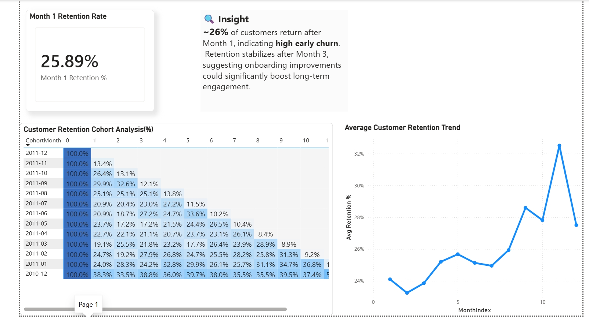
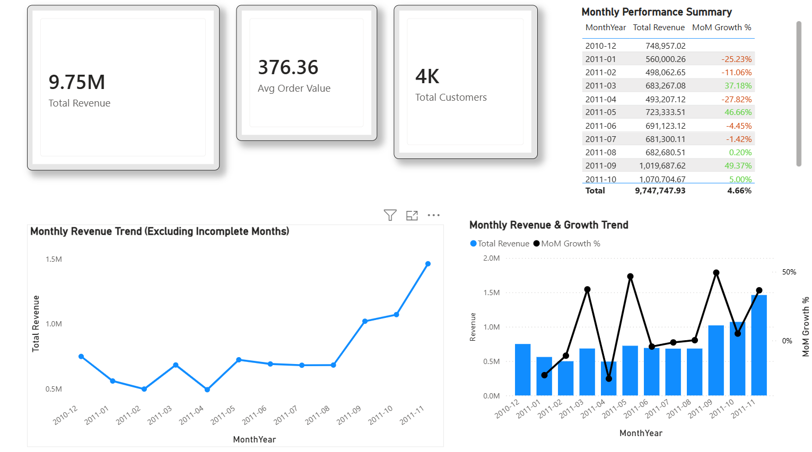

# 📊 Customer Retention & Cohort Analysis

## 📌 Project Overview
This project analyzes customer retention using cohort analysis. It includes data cleaning, revenue analysis, growth trends, and customer segmentation using SQL and Power BI.

---

## 🛠 Tools Used
- SQL (SQLite)
- Power BI
- Excel

---

## 🔍 Key Analysis
- Data cleaning and preprocessing
- Monthly revenue analysis
- Growth rate calculation
- Customer segmentation (New vs Returning)
- Cohort retention analysis

---

## 📊 Dashboard Preview

### Cohort Analysis Heatmap


### Retention Trend


---
## 📁 Project Structure

```
├── sql/
│   ├── data_cleaning.sql
│   ├── revenue_analysis.sql
│   ├── cohort_analysis.sql
│   ├── customer_segmentation.sql
│   └── growth_analysis.sql

├── images/
│   ├── cohort_heatmap.png
│   └── retention_trend.png

├── customer_retention_dashboard.pbix

└── README.md
```
## 📊 Key Insights

- Customer retention drops significantly after the first month
- Returning customers contribute higher revenue than new users
- Peak revenue observed during specific seasonal months
- Growth trend shows steady increase after initial dip
- Cohort analysis reveals long-term customer value patterns
## 🎯 Problem Statement

Businesses often struggle to understand customer retention and long-term value.  
This project analyzes customer behavior using cohort analysis to identify retention patterns, revenue trends, and customer segments.

## ⚙️ How to Use

1. Download the dataset
2. Run SQL scripts in order:
   - data_cleaning.sql
   - cohort_analysis.sql
   - revenue_analysis.sql
3. Open the Power BI file (.pbix)
4. Explore dashboards and insights

## 📁 Dataset

- Source: Online Retail Dataset
- Contains transaction-level data
- Columns include: CustomerID, InvoiceDate, Quantity, Revenue

## 🧠 Skills Demonstrated

- SQL (joins, aggregations, cohort logic)
- Data cleaning & preprocessing
- Business analysis
- Power BI dashboard creation
- Data visualization & storytelling
